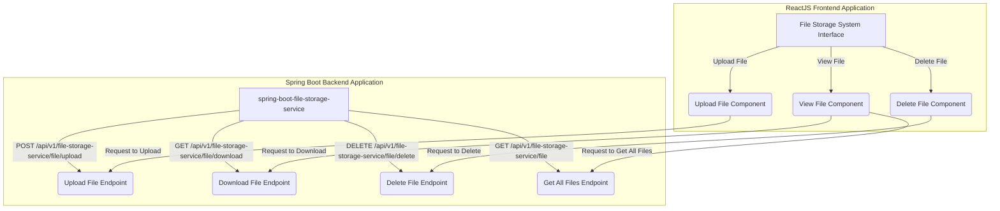
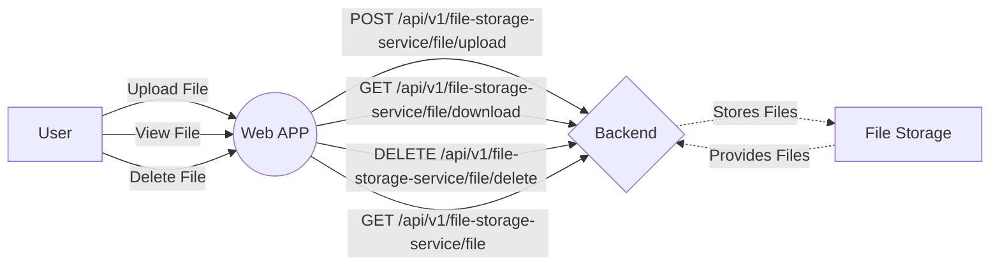
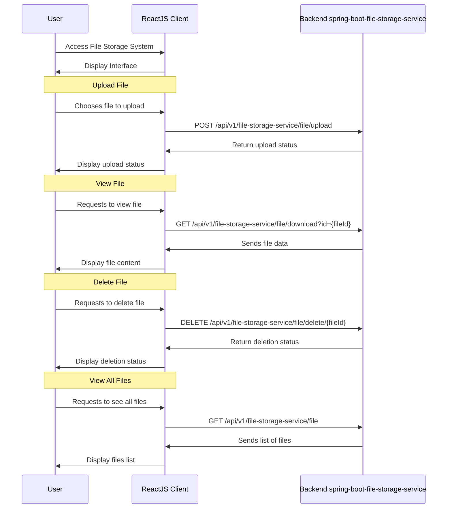

# File Storage System - file-storage-ui

File Storage System is a web application built with ReactJS for managing files. It allows users to upload, view, and delete files conveniently.

## Table of Contents

- [Features](#features)
- [Application Flow](#application-flow)
- [Flowchart Diagram](#flowchart-diagram)
- [Sequence Diagram](#sequence-diagram)
- [Backend Application: spring-boot-file-storage-service](#backend-application-spring-boot-file-storage-service)
- [Frontend Application: file-storage-ui](#frontend-application-file-storage-ui)
- [Installation](#installation)
- [Usage](#usage)
- [Contributing](#contributing)
- [License](#license)
- [Acknowledgements](#acknowledgements)
- [Author](#author)

## Features

- **Upload File:** Users can upload files to the system.
- **View File:** Users can view files stored in the system.
- **Delete File:** Users can delete files from the system.

## Application Flow



## Flowchart Diagram



## Sequence Diagram



## Backend Application: spring-boot-file-storage-service

The backend application, named `spring-boot-file-storage-service`, provides the following endpoints:

- **Upload File Endpoint:** POST `/api/v1/file-storage-service/file/upload`
- **Download File Endpoint:** GET `/api/v1/file-storage-service/file/download?id={fileId}`
- **Delete File Endpoint:** DELETE `/api/v1/file-storage-service/file/delete/{fileId}`
- **Get All Files Endpoint:** GET `/api/v1/file-storage-service/file`

Backend Code Repository URL:

```bash
git clone https://github.com/siddhantpatni0407/spring-boot-microservices.git
```

## Frontend Application: file-storage-ui

The frontend application, named `file-storage-ui`, is built using ReactJS.

## Installation

To run this project locally, follow these steps:

1. Clone the repository:

    ```bash
    git clone https://github.com/siddhantpatni0407/react-js.git
    ```

2. Navigate to the project directory:

    ```bash
    cd file-storage-system
    ```

3. Install dependencies:

    ```bash
    npm install
    ```

4. Install axios for making HTTP requests:

    ```bash
    npm install axios
    ```

5. Install Bootstrap for styling:

    ```bash
    npm install bootstrap@5.3.3
    ```

6. Install Font Awesome for icons:

    ```bash
    npm install @fortawesome/fontawesome-free@6.5.1
    npm install @fortawesome/free-solid-svg-icons@6.5.1
    npm install @fortawesome/react-fontawesome@0.2.0
    ```

7. Start the development server:

    ```bash
    npm start
    ```

8. Open your web browser and go to [http://localhost:3000](http://localhost:3000) to view the app.

## Usage

- **Uploading Files:** Click on the "Upload File" button in the navigation bar to upload files.
- **Viewing Files:** Navigate to the "All Files" page to view all uploaded files.
- **Deleting Files:** Click on the "Delete" button next to a file to delete it.

## Contributing

Contributions are welcome! Please follow these steps to contribute:

1. Fork the repository.
2. Create a new branch: `git checkout -b feature/my-feature`.
3. Make your changes and commit them: `git commit -am 'Add some feature'`.
4. Push to the branch: `git push origin feature/my-feature`.
5. Submit a pull request.

## License

This project is licensed under the MIT License. See the [LICENSE](LICENSE) file for details.

## Acknowledgements

- [React](https://reactjs.org/)
- [Bootstrap](https://getbootstrap.com/)
- [FontAwesome](https://fontawesome.com/)

## Author

Siddhant Patni
